# Architecture

## The core problem: a package that doesn't know its runtime

Astropress ships as an npm package (`astropress`) that contains all admin pages, components, and business logic. Those admin pages need to call the database. But the database is **not the package's responsibility** — it belongs to the host application.

The host app might use SQLite (for local dev and GitHub Pages), Cloudflare D1, Supabase, Runway, or something else entirely. The package cannot bundle all of these — and shouldn't.

## The Vite alias seam

The solution is a single Vite module alias:

```
"local-runtime-modules"  →  host-app/src/astropress/local-runtime-modules.ts
```

Every place in the astropress package that needs a database or auth store imports from `"local-runtime-modules"`:

```ts
// Inside packages/astropress/src/sqlite-admin-runtime.ts
import { getDatabase } from "local-runtime-modules";
```

At build time, Vite resolves `"local-runtime-modules"` to whatever file the host app has registered under that alias. The admin pages never import the host app directly — they import a stable contract name, and Vite fills in the actual implementation.

```
Astro build (host app)
  └─ Vite
      └─ alias: "local-runtime-modules"
          └─ src/astropress/local-runtime-modules.ts   ← written by the host app
              └─ uses: astropress/adapters/sqlite        (or cloudflare, supabase, etc.)
```

The alias is injected by `vite-integration.ts` inside the astropress package, which the host app's `astro.config.mjs` calls via `astropressIntegration()`.

## Adding a new provider

To add a new provider (e.g., a self-hosted Postgres service):

1. Create `packages/astropress/src/adapters/custom.ts` implementing `AstropressPlatformAdapter` from `platform-contracts.ts`.
2. Export it from the package and add it to `package.json` exports.
3. The host app's `local-runtime-modules.ts` imports and uses the new adapter factory.

No admin pages, components, or templates change. The seam absorbs the difference.

## Build output: `src/` is TypeScript-only, `dist/` is the emitted JS

`packages/astropress/src/` contains only `.ts` source. `bun run build` runs
`tsc -p tsconfig.build.json --noCheck` with `outDir: "./dist"`, then
`tooling/scripts/add-js-ext.ts dist` to rewrite extensionless relative imports
to `.js`. The emitted tree lives at `packages/astropress/dist/src/*.js` and
`packages/astropress/dist/index.js`; `dist/` is gitignored.

`package.json` `exports` points the `default` condition at the compiled
`./dist/src/*.js`, while `types` still points at the `.ts` source — no
`.d.ts` emission is required.

The `no-js-in-src` rule in `tooling/scripts/arch-lint.ts` fails the build if a
`.js` file appears inside `src/` or at `packages/astropress/index.js`, so the
previous dual-file pattern cannot regress. Tests resolve directly to `.ts` via
the `extensionAlias` / alias rules in `vitest.config.ts`, bypassing the
`exports` map.

## Admin pages and components

Admin pages live in `packages/astropress/pages/ap-admin/`. They are Astro pages that:
- Import from `"astropress"` (re-exports from the package itself)
- Import from `"local-runtime-modules"` (resolved at build time to the host app's runtime)
- Never import from host-app paths directly

This means the package can be updated independently of the host app.

## Web Components

Client-side interactivity uses native Custom Elements (Web Components) registered in `packages/astropress/web-components/`. They are:
- **Light DOM** — CSS custom properties from the host page apply naturally
- **Progressive enhancement** — the admin UI is functional even if JavaScript is blocked
- **AbortController** — event listeners are cleaned up declaratively in `disconnectedCallback`

See [WEB_COMPONENTS.md](./reference/WEB_COMPONENTS.md) for the authoring guide.

## Provider contract

All providers implement the `AstropressProviderContract` interface defined in `src/platform-contracts.ts`. The contract covers:

```ts
interface AstropressProviderContract {
  capabilities: ProviderCapabilities;
  auth: AuthStore;
  content: ContentStore;
  media: MediaStore;
  revisions: RevisionStore;
  gitSync?: GitSyncStore;
  deploy?: DeployStore;
  importer?: ImporterStore;
  preview?: PreviewStore;
}
```

Admin templates consume this contract. Provider differences (D1 vs. SQLite vs. Supabase) are entirely inside the adapter, behind the stable interface.

## Database schema

### Entity-relationship diagram

```mermaid
erDiagram
    %% Auth
    admin_users {
        text id PK
        text email
        text password_hash
        text role
        text name
        int  active
        text created_at
    }
    admin_sessions {
        text id PK
        text user_id FK
        text csrf_token
        text created_at
        text last_active_at
        text revoked_at
        text ip_address
        text user_agent
    }
    password_reset_tokens {
        text id PK
        text user_id FK
        text token_hash
        text created_at
        text expires_at
        text consumed_at
        text requested_by
    }
    user_invites {
        text id PK
        text user_id FK
        text token_hash
        text created_at
        text expires_at
        text accepted_at
        text invited_by
    }

    %% Content
    content_entries {
        text slug PK
        text legacy_url
        text title
        text kind
        text template_key
        text body
        text summary
    }
    content_overrides {
        text slug PK
        text title
        text status
        text scheduled_at
        text body
        text updated_at
        text updated_by
    }
    content_revisions {
        text id PK
        text slug FK
        text source
        text title
        text status
        text body
        text created_at
        text created_by
    }

    %% Taxonomy
    authors {
        text id PK
        text slug
        text name
        text bio
        text deleted_at
    }
    categories {
        text id PK
        text slug
        text name
        text description
        text deleted_at
    }
    tags {
        text id PK
        text slug
        text name
        text description
        text deleted_at
    }
    content_authors {
        text slug FK
        text author_id FK
    }
    content_categories {
        text slug FK
        text category_id FK
    }
    content_tags {
        text slug FK
        text tag_id FK
    }

    %% Media & Redirects
    media_assets {
        text id PK
        text source_url
        text local_path
        text r2_key
        text mime_type
        int  width
        int  height
        int  file_size
        text alt_text
        text deleted_at
    }
    redirect_rules {
        text source_path PK
        text target_path
        int  status_code
        text deleted_at
    }

    %% Comments & Submissions
    comments {
        text id PK
        text author
        text email
        text body
        text route
        text status
        text policy
        text submitted_at
    }
    contact_submissions {
        text id PK
        text name
        text email
        text message
        text submitted_at
    }

    %% CMS Routes
    cms_route_groups {
        text id PK
        text kind
        text render_strategy
        text canonical_locale
        text canonical_path
    }
    cms_route_variants {
        text id PK
        text group_id FK
        text locale
        text path
        text status
        text title
        text body_html
    }
    cms_route_aliases {
        text path PK
        text target_variant_id FK
        text mode
        int  status_code
    }
    cms_route_revisions {
        text id PK
        text variant_id FK
        text route_path
        text locale
        text snapshot_json
        text created_at
    }

    %% Audit & Settings
    audit_events {
        text id PK
        text user_email
        text action
        text resource_type
        text resource_id
        text summary
        text created_at
    }
    site_settings {
        int  id PK
        text site_title
        text site_tagline
        text admin_slug
        text updated_at
        text updated_by
    }
    rate_limits {
        text key PK
        int  count
        int  window_start_ms
        int  window_ms
    }
    schema_migrations {
        text id PK
        text name
        text applied_at
    }

    %% Relationships
    admin_users ||--o{ admin_sessions : "has"
    admin_users ||--o{ password_reset_tokens : "has"
    admin_users ||--o{ user_invites : "has"
    content_entries ||--o{ content_revisions : "versioned by"
    content_entries ||--o{ content_authors : "linked to"
    content_entries ||--o{ content_categories : "in"
    content_entries ||--o{ content_tags : "tagged"
    authors ||--o{ content_authors : "appears in"
    categories ||--o{ content_categories : "appears in"
    tags ||--o{ content_tags : "appears in"
    cms_route_groups ||--o{ cms_route_variants : "has locales"
    cms_route_variants ||--o{ cms_route_aliases : "aliased by"
    cms_route_variants ||--o{ cms_route_revisions : "versioned by"
```



### The content_entries / content_overrides two-table pattern

`content_entries` holds **imported, immutable source data**. Rows are written once by the WordPress importer (or other import pipelines) and never mutated by the editorial UI. This preserves the original imported content as a reference.

`content_overrides` holds **editorial mutations** keyed by the same `slug`. When the admin edits a post, the change goes into `content_overrides`, not back into `content_entries`. The runtime merges the two at read time: override fields shadow entry fields when present.

This means:
- Import operations are idempotent — re-importing won't destroy editorial changes
- Editors can revert to the imported original by deleting the override row
- Audit history is clean — `content_revisions` tracks only intentional editorial decisions

### The rate_limits table

Rate limiting uses an application-managed sliding window stored in `rate_limits`. The `window_start_ms` column marks the start of the current window epoch; the runtime increments `count` within the window and rejects requests that exceed the threshold.

There is no DB-native TTL or auto-expiry. Stale rows are cleaned up lazily by the runtime during each rate-limit check. This is acceptable for SQLite (single-writer, low concurrency); hosted providers with high request rates should consider a dedicated rate-limiting service.

### D1 session persistence gap

Cloudflare D1-backed deployments currently store session data in the `admin_sessions` table, which is durable. However, the initial implementation used an in-memory session map as a fallback before D1 was wired up — traces of this may exist in older adapter revisions. If you encounter session state that does not persist across Worker restarts, confirm that `CLOUDFLARE_SESSION_SECRET` is set and the D1 binding is correctly configured. In-memory fallback is a known roadmap item to eliminate entirely.

## Security model

Astropress uses a layered security model:

1. **Session tokens** — PBKDF2-hashed, stored in SQLite `admin_sessions`; session IDs are never exposed
2. **CSRF tokens** — per-session token validated on all state-mutating form actions
3. **CSP** — per-area Content-Security-Policy (public / auth / admin / api areas have different policies)
4. **Origin checks** — `isTrustedRequestOrigin()` validates `Origin` and `Referer` headers
5. **HTML sanitization** — `sanitizeHtml()` uses `Bun.HTMLRewriter` to allowlist tags and attributes before storing post bodies
6. **Cache-Control** — `applyAstropressSecurityHeaders()` sets `Cache-Control: private, no-store` on all admin/auth/api routes automatically
